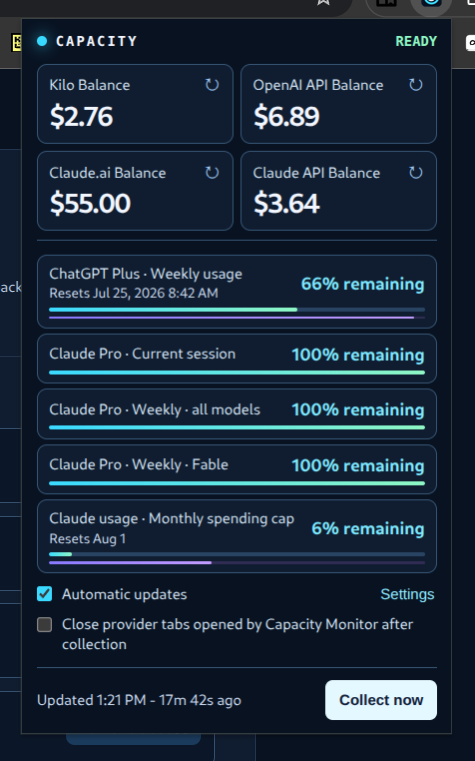
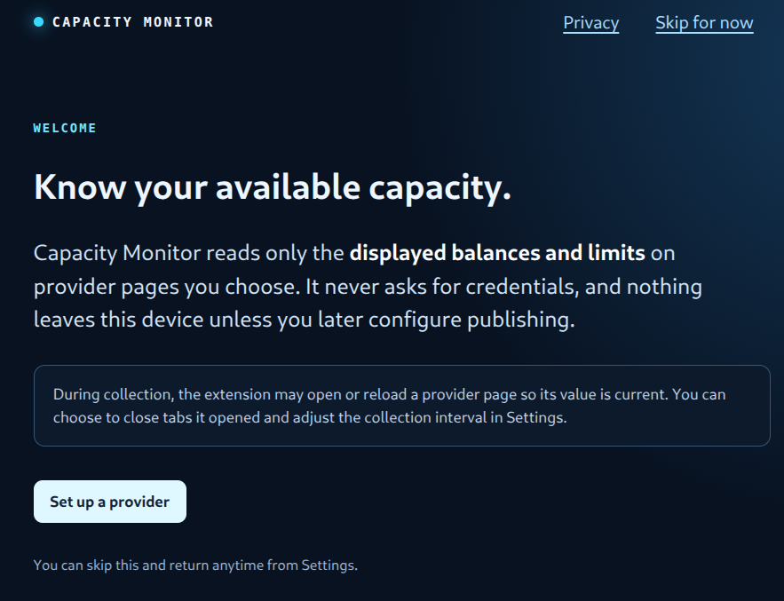
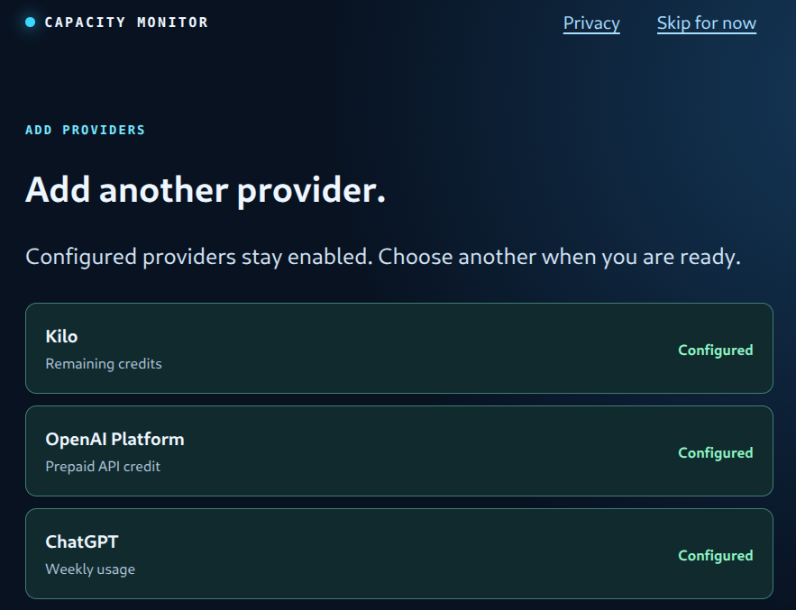
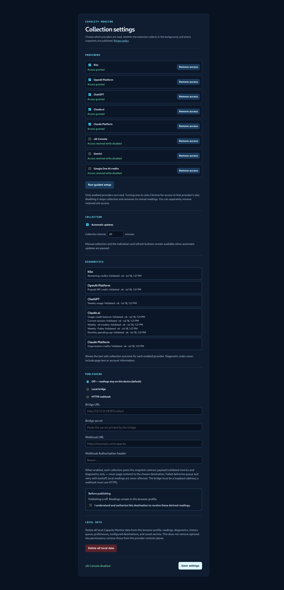

# AI Capacity Monitor

AI Capacity Monitor is a Chrome extension for keeping the displayed credit
balances and subscription limits you care about in one local popup. It reads
only the provider pages you explicitly enable, remains useful without any
service account, and can optionally publish a normalized snapshot to a
destination you choose.

## What it does

- Reads visible balances and plan-limit readings from selected, authenticated
  provider pages.
- Keeps the latest safe reading in the local browser profile, with explicit
  diagnostics when a value is stale, suspicious, unavailable, or needs sign-in.
- Requests each provider's site access only when you enable it.
- Optionally posts derived snapshots to a local bridge or HTTPS webhook after
  you review and acknowledge the exact destination.

It never asks for credentials and does not store or publish raw provider-page
text, browser cookies, or account identifiers.

## See it in use

The toolbar popup puts balances, plan limits, reset windows, and freshness in
one place. Individual readings can open or focus their provider page.

Guided setup requests access one provider at a time and keeps previously
configured providers enabled while you add more.

Settings show enabled providers, collection controls, safe diagnostics,
optional publishing, and local-data deletion.

## Install

For local or pre-Store testing, follow the [install guide](docs/install.md).
Guided setup walks through one provider at a time and confirms the first
reading. The popup works on its own; the local bridge and dashboard are
optional advanced components.

## Supported providers

See the complete [support matrix](docs/support-matrix.md) for the exact page,
metric, verified plan surface, and known limitations for Kilo, OpenAI,
ChatGPT, Claude, xAI, Gemini, and Google One.

## Privacy and security

Read the [privacy policy](docs/privacy-policy.md) for the precise local
storage, optional publishing, and deletion behavior. Use **Delete all local
data** in Settings to clear stored readings, settings, destinations, queues,
and secrets. See [SECURITY.md](SECURITY.md) for private vulnerability reports.

## Development

- Extension tests: `npm test --prefix apps/extension`
- Package: `python3 scripts/package-extension.py`
- Contribution guide: [CONTRIBUTING.md](CONTRIBUTING.md)
- Troubleshooting: [docs/troubleshooting.md](docs/troubleshooting.md)
- Chrome Web Store permission draft: [docs/web-store-permissions.md](docs/web-store-permissions.md)

## License

Apache-2.0. See [LICENSE](LICENSE).
